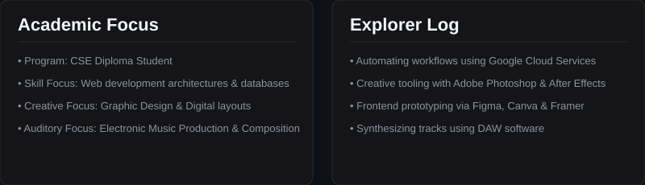
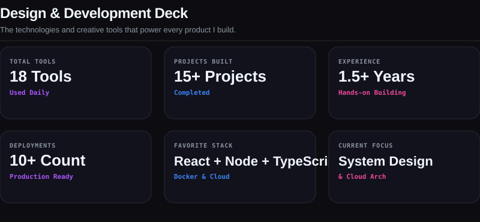
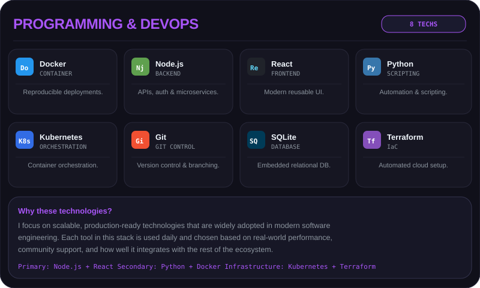
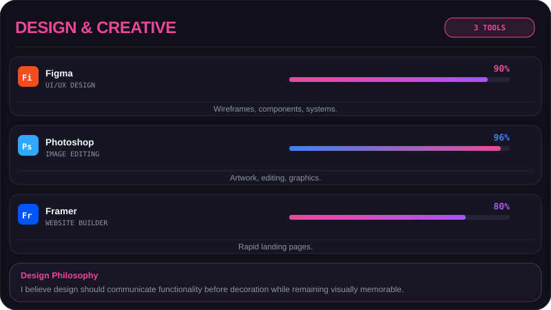
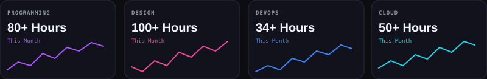
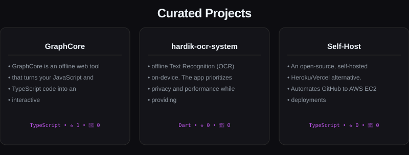

<!-- NAVIGATION BAR -->

<a href="#about-me"><b>About Me</b></a> •
<a href="#skills"><b>Skills Deck</b></a> •
<a href="#projects"><b>Featured Projects</b></a> •
<a href="#metrics"><b>Metrics Dashboard</b></a> •
<a href="#contact"><b>Contact</b></a>

<!-- PREMIUM HERO BANNER -->

<picture>
<source media="(prefers-color-scheme: dark)" srcset="banner.svg?v=1">
<source media="(prefers-color-scheme: light)" srcset="banner-light.svg?v=1">

</picture>

 

<!-- MAIN WEBSITE CONTAINER SCREEN -->

<!-- SECTION 1: HEADER & NAVIGATION -->
<table width="100%" border="0" cellpadding="0" cellspacing="0" style="border-collapse: collapse; border: none;">
<tr>
<td style="border: none; text-align: left;">
PORTFOLIO SCREEN
</td>
<td align="right" style="border: none;">

<a href="#about" style="color: #8b949e; text-decoration: none;">ABOUT</a> &nbsp;•&nbsp;
<a href="#skills" style="color: #8b949e; text-decoration: none;">SKILLS</a> &nbsp;•&nbsp;
<a href="#projects" style="color: #8b949e; text-decoration: none;">PROJECTS</a> &nbsp;•&nbsp;
<a href="#metrics" style="color: #8b949e; text-decoration: none;">STATS</a> &nbsp;•&nbsp;
<a href="#contact" style="color: #8b949e; text-decoration: none;">CONTACT</a>

</td>
</tr>
</table>

<!-- SECTION 2: HERO PROFILE DASHBOARD -->
<table width="100%" border="0" cellpadding="0" cellspacing="0" style="border-collapse: collapse; border: none;">
<tr>
<!-- Swinging Lanyard (ID Badge) -->
<td valign="top" width="35%" align="center" style="border: none;">

</td>
<!-- Bio Summary Content -->
<td valign="top" width="65%" style="padding-left: 30px; border: none; text-align: left;">
<h1 style="color: #f0f6fc; margin: 0 0 5px 0; font-size: 34px; font-family: -apple-system, BlinkMacSystemFont, 'Segoe UI', Roboto, sans-serif;">Hardik Khyal</h1>
<h3 style="color: #bf55ec; margin: 0 0 15px 0; font-weight: 500; font-size: 16px; font-family: monospace; letter-spacing: 0.5px;">CSE Diploma Student • Graphic Designer • Web Developer • Music Producer</h3>

Building scalable web applications, crafting compelling visual identities, and exploring modern DevOps workflows. Passionate about transforming ideas into polished digital products through code, design, and creativity.

Currently focused on React, Node.js, Docker, AWS, UI/UX Design, and Open Source while continuously expanding my skills across software engineering and digital media.

&nbsp;&nbsp;
&nbsp;&nbsp;
&nbsp;&nbsp;
&nbsp;&nbsp;

</td>
</tr>
</table>

<!-- SECTION 3: ABOUT DETAIL PANELS -->

<!-- SECTION 4: DEVELOPER TOOLKIT DASHBOARD -->

<!-- stats table legacy removed -->

 

 

 
<h3 style="color: #f0f6fc; font-family: -apple-system, BlinkMacSystemFont, 'Segoe UI', Inter, sans-serif; font-size: 24px; font-weight: 800; margin: 20px 0 6px 0; letter-spacing: -0.5px; text-align: left;">Certifications &amp; Badges</h3>
 

<table width="100%" border="0" cellpadding="0" cellspacing="0" style="border-collapse: collapse; border: none; background: transparent;">
<!-- GDG Jalandhar -->
<tr>
<td valign="top" style="border: none; padding: 12px 0; width: 60px; text-align: left;">

</td>
<td valign="top" style="border: none; padding: 12px 0; text-align: left;">
GDG Jalandhar 
Google Developer Groups community chapter member and active contributor.
</td>
</tr>
<!-- Gemini Enterprise Agent Ready -->
<tr>
<td valign="top" style="border: none; padding: 12px 0; width: 60px; text-align: left;">

</td>
<td valign="top" style="border: none; padding: 12px 0; text-align: left;">
Gemini Enterprise Agent Ready 
Level up your agent building skills with GEAR. Go from prototyping with Gemini to deploying secure, enterprise-grade agents on Vertex AI with hands-on training and guidance from Google experts. (Earned May 19, 2026)
</td>
</tr>
<!-- Google Cloud Innovator -->
<tr>
<td valign="top" style="border: none; padding: 12px 0; width: 60px; text-align: left;">

</td>
<td valign="top" style="border: none; padding: 12px 0; text-align: left;">
Google Cloud Innovator 
Member of the Google Cloud Innovators community, exploring advanced cloud architectures and tools.
</td>
</tr>
<!-- Databricks Academy -->
<tr>
<td valign="top" style="border: none; padding: 12px 0; width: 60px; text-align: left;">

</td>
<td valign="top" style="border: none; padding: 12px 0; text-align: left;">
Generative AI Fundamentals 
Accreditation from Databricks Academy covering core LLM architectures, generative modeling, and applications.
</td>
</tr>
<!-- Aptech Learning -->
<tr>
<td valign="top" style="border: none; padding: 12px 0; width: 60px; text-align: left;">

</td>
<td valign="top" style="border: none; padding: 12px 0; text-align: left;">
Web Development using Python 
Professional training and certification program from Aptech Learning.
</td>
</tr>
</table>

<!-- SECTION 5: PROJECTS SHOWCASE CARDS -->

<!-- PINNED-REPOS:START -->

<table width="100%" border="0" cellpadding="0" cellspacing="0" style="border-collapse: collapse; border: none; margin-top: 15px;">
<tr>
  <td width="50%" valign="top" style="border: none; padding: 6px;">
    

      <a href="https://github.com/Hardikkhyal/free-background-remover" target="_blank" style="color: #bf55ec; font-size: 15px; font-weight: 700; text-decoration: none; font-family: monospace;">📦 free-background-remover</a>
      
Free, unlimited, privacy-first AI background remover that runs entirely in your browser. No uploads, no watermarks, no login required.

      

        ● JavaScript &nbsp;&nbsp;⭐ 1 &nbsp;&nbsp;🍴 0
      

    

  </td>
  <td width="50%" valign="top" style="border: none; padding: 6px;">
    

      <a href="https://github.com/Hardikkhyal/hr-studios" target="_blank" style="color: #bf55ec; font-size: 15px; font-weight: 700; text-decoration: none; font-family: monospace;">📦 hr-studios</a>
      
 A premium, responsive, and modern E-Commerce Web Application built with Django, customized for musical instrument sales. Featuring a modern dark glassmorphism user interface with responsive layout grids, smooth hover animations, and intuitive cart management. 

      

        ● HTML &nbsp;&nbsp;⭐ 1 &nbsp;&nbsp;🍴 0
      

    

  </td>
</tr>
<tr>
  <td width="50%" valign="top" style="border: none; padding: 6px;">
    

      <a href="https://github.com/Hardikkhyal/link-tree" target="_blank" style="color: #bf55ec; font-size: 15px; font-weight: 700; text-decoration: none; font-family: monospace;">📦 link-tree</a>
      
cross-device sharing application designed to provide seamless file and text transfers between mobile devices (Android / iOS) and laptops (Windows / macOS / Linux) 

      

        ● Dart &nbsp;&nbsp;⭐ 1 &nbsp;&nbsp;🍴 0
      

    

  </td>
  <td width="50%" valign="top" style="border: none; padding: 6px;">
    

      <a href="https://github.com/Hardikkhyal/hardik-ocr-system" target="_blank" style="color: #bf55ec; font-size: 15px; font-weight: 700; text-decoration: none; font-family: monospace;">📦 hardik-ocr-system</a>
      
offline Text Recognition (OCR) on-device. The app prioritizes privacy and performance while providing a stunning, dark-themed user experience.

      

        ● Dart &nbsp;&nbsp;⭐ 1 &nbsp;&nbsp;🍴 0
      

    

  </td>
</tr>
</table>

<!-- PINNED-REPOS:END -->

<!-- SECTION 6: METRICS DASHBOARD PANEL -->
<h3 style="color: #f0f6fc; font-family: -apple-system, BlinkMacSystemFont, 'Segoe UI', Inter, sans-serif; font-size: 24px; font-weight: 800; margin: 0 0 6px 0; letter-spacing: -0.5px; text-align: left;">Metrics &amp; Live Contributions</h3>
 

<table width="100%" border="0" cellpadding="0" cellspacing="0" style="border-collapse: collapse; border: none;">
<tr>
<td width="50%" align="center" style="border: none; padding-right: 5px;">

</td>
<td width="50%" align="center" style="border: none; padding-left: 5px;">

</td>
</tr>
</table>
 

<!-- Snake game section -->
<h5 style="color: #8b949e; font-family: monospace; font-size: 12px;">&lt; Snake Game Contributions /&gt;</h5>
<picture>
  <source media="(prefers-color-scheme: dark)" srcset="https://raw.githubusercontent.com/hardikkhyal/hardikkhyal/output/github-snake-dark.svg" />
  <source media="(prefers-color-scheme: light)" srcset="https://raw.githubusercontent.com/hardikkhyal/hardikkhyal/output/github-snake.svg" />
  
</picture>

<!-- SECTION 7: RANDOM DEV QUOTE -->
<h3 style="color: #f0f6fc; font-family: -apple-system, BlinkMacSystemFont, 'Segoe UI', Inter, sans-serif; font-size: 24px; font-weight: 800; margin: 0 0 6px 0; letter-spacing: -0.5px; text-align: left;">Random Dev Quote</h3>
 

  

<!-- SECTION 8: CONNECT & FOOTER -->
<h3 style="color: #f0f6fc; font-family: -apple-system, BlinkMacSystemFont, 'Segoe UI', Inter, sans-serif; font-size: 24px; font-weight: 800; margin: 0 0 6px 0; letter-spacing: -0.5px; text-align: left;">Let's Collaborate</h3>

Open for collaborations on digital designs, React frontend builds, and web application deployments.

 

<table width="100%" border="0" cellpadding="0" cellspacing="0" style="border-collapse: collapse; border: none;">
<tr>
<!-- Badges -->
<td style="border: none; text-align: left;">
&nbsp;&nbsp;
&nbsp;&nbsp;
&nbsp;&nbsp;
&nbsp;&nbsp;

</td>
<!-- Visitor Count Badge -->
<td align="right" style="border: none;">
  
</td>
</tr>
</table>

 

© 2026 Hardik Khyal. Built with animated SVG &amp; GitHub Markdown components.

